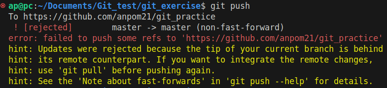
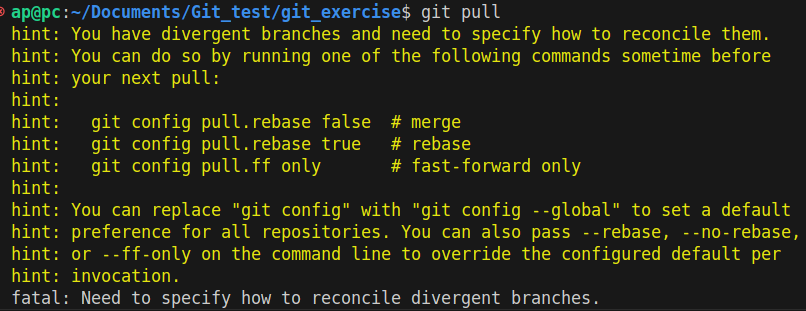
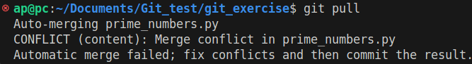
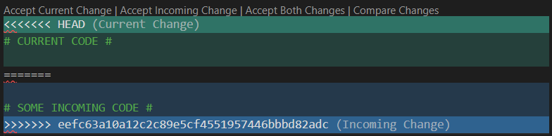

# Exercise: A Journey Through Git

## Goal
Learn the fundamentals of Git by working on a Python project that computes prime numbers and generates Fibonacci sequences, while navigating through various Git commands.

### Step 1: Initialize a Git Repository
1. **Navigate to desired directory**

   Make sure to make it in a folder that is not synchronized ie. no OneDrive, Google Drive or similar. One safe spot is the user folder which can be navigated to in a **powershell** or a **linux terminal** simply with:
   ``` bash
   cd ~
   ```
 

2. **Create a new directory**
   ```bash
   mkdir git_exercise
   cd git_exercise
   ```

3. **Initialize a Git repository**:
   ```bash
   git init
   ```

4. **Check the status** of your repository:
   ```bash
   git status
   ```
   At this point, there should be nothing tracked.

---

### Step 2: Write a Python Program to Compute Prime Numbers
1. **Create a Python file** named `prime_numbers.py` and write code that checks if a number is prime **[COPY PASTE]**:
   ```python
   def is_prime(num):
    if num < 2:
        return False
    for i in range(2, int(num**0.5) + 1):
        if num % i == 0:
            return False
    return True

   def get_primes(n):
       primes = []
       for i in range(2, n+1):
           if is_prime(i):
               primes.append(i)
       return primes

   if __name__ == "__main__":
       n = int(input("Find primes up to: "))
       print(get_primes(n))
   ```
2. **Check that the code runs as expected.**

---

### Step 3: Stage and Commit the Changes
1. **Add the file** to the staging area:
   ```bash
   git add prime_numbers.py
   ```
   
2. **Check the status**:
   ```bash
   git status
   ```
3. **Commit your changes**:
   ```bash
   git commit -m "Add prime number computation"
   ```
   

4. Now is a good time to **mark** the commit with a ```tag``` to indicate that up until this commit the stuff is working.
   ```bash
   git tag prime_number
   ```
   
5. Check the history of your repository.
   ```bash
   git log
   ```
---

### Step 4: Create a Remote Repository (on GitHub/GitLab)
1. **Create a remote repository** on GitHub/GitLab.

2. **Link your local repository** to the remote repository:
   ```bash
   git remote add origin https://github.com/username/git_exercise.git
   ```
   
3. **Push your code** to the remote repository:
   ```bash
   git push -u origin main
   ```
   
---

### Step 5: Clone the Repository to Another Folder
1. **Navigate out** of the current folder and clone the repository to a new location:
   ```bash
   cd ..
   git clone https://github.com/username/git_repo.git clone-folder
   ```
   
2. **Move into the cloned repository**:
   ```bash
   cd clone-folder
   ```

---
### Step 6: Create a Branch Named "fibonacci"
1. **Create a new branch** named `fibonacci`:
   ```bash
   git switch -c fibonacci
   ```
   The command ```switch``` allows you to switch between branches and different commits. When the ```-c``` flag is used in combination, a new branch will be **created** with a designated name as the last parameter, in this case ```fibonacci```.

---

### Step 7: Implement a Fibonacci Sequence Generator
1. **Create a new file `fibo_numbers.py`** to include a function for generating Fibonacci numbers **[COPY PASTE]**:
   ```python
   def fibonacci(n):
       fib_sequence = [0, 1]
       while len(fib_sequence) < n:
           fib_sequence.append(fib_sequence[-1] + fib_sequence[-2])
       return fib_sequence

   if __name__ == "__main__":
       fib_n = int(input("Generate how many Fibonacci numbers? "))
       print(fibonacci(fib_n))
   ```

2. **Add and commit the changes**:


---

### Step 8: Merge the "fibonacci" Branch with Main
1. **Merge the `fibonacci` branch** into the main branch:
   ```bash
   git merge fibonacci
   ```

2. **Run the code again** to ensure both prime number and Fibonacci functions are present.

---

### Step 9: Make a Change in the Cloned Repository and Push It
1. **Modify `prime_numbers.py`** to compute primes between two input numbers **[COPY PASTE]**:
   ```python
   def get_primes(m, n):
       primes = []
       for i in range(m, n+1):
           if is_prime(i):
               primes.append(i)
       return primes

   if __name__ == "__main__":
       m = int(input("Start prime search from: "))
       n = int(input("Find primes up to: "))
       print(get_primes(m, n))
   ```

2. **Add**, **commit**, and **push** the changes:


   

---

### Step 11: Make Another Change in the Original Repository 
1. **Return to the original folder**:
   ```bash
   cd ../git_exercise
   ```

2. **Modify `prime_numbers.py`** (don't pull yet) to print the number of primes found **[COPY PASTE]**:
   ```python
   print(f"Number of primes found: {len(get_primes(m, n))}")
   ```

3. **Add and commit the changes to make a merge conflict**:
   ```bash
   git add prime_numbers.py
   git commit -m "Add print statement for number of primes"
   ```

4. **Push the changes**:
   ```bash
   git push
   ```
   You will probably see something like this:
   
   Now this is something that will happen when you work in teams on bigger projects. And it will especially happen if you dont make branches in your projects. 
   So **remember** to use branches to divide your projects!
5. **If push didn't work try pulling first**:
   ```bash
   git pull
   ```
   If you see this:
   
   You can basically handle your divergent paths in different ways, I prefer merging as it is simple, and works.
   ```bash
   git config pull.rebase false  # merge
   ```
   Now try to pull again.
   ```bash
   git pull
   ```
   Now you should get a merge conflict.
   
---

### Step 12: Resolve the Merge Conflict
Merge conflicts are very common when working on projects and files which are frequently edited. Therefore it is important to know what a **merge conflict** entails and how you can quickly be on with your day.
A merge conflict happens in Git when two branches have conflicting changes to the same part of a file, and git doesn't know how to automatically merge them. This requires manual intervention to resolve.

1. **Understanding** the merge conflict. 

The first place you will see the merge conflict is in the terminal as mentioned before. Here it state all the files in which a merge conflict occured. In our instance it will look something like this:

You can see that a merge conflict occured in ```prime_numbers.py``` from the line:
```CONFLICT (content): Merge conflict in prime_numbers.py```

Now go to ```prime_numbers.py``` to resolve the merge conflict.

A merge conflict is not dangerous fear not! Lets disect it together.
   
- A merge conflict will begin with a ```<<<<<<< HEAD``` statement to indicate the changes of the current branch. 
   
- Following this statement will be some ```# CURRENT CODE #``` of the current branch.

- Then some divider signs ```=======``` to seperate the **current** and **incoming** code.

- Then ```# SOME INCOMING CODE #```.

- Finally the end of the merge conflict will be shown with some arrows and the commit id ```>>>>>>> eefc6...2adc```. This is convenient if you should want to investigate the commit that casued the merge conflict further.

If you are using VScode the merge conflict will look like this:


It can be resolved either by only keeping the code you want and deleting the rest or simply clicking one of the bottoms at the top.


2. **Resolve the merge conflict** in `prime_numbers.py`. 
Combine the changes 

3. **Stage and commit** the resolved file.


4. **Push** the resolved changes.


---

### Final Thoughts
This exercise covers the complete workflow of using Git in a project: initializing a repository, working with remotes, cloning, resolving conflicts, branching, and merging.

---
# A common work/ project situation
Often when working on projects in a team merge conflicts, changing files, deleted files and name changes are common. We should be able to handle all of these situations in git. 
